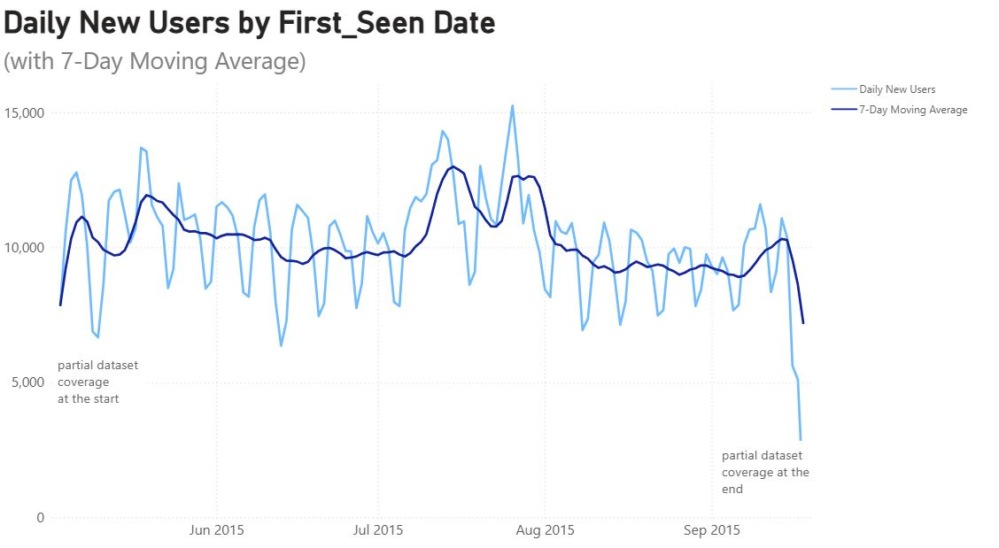
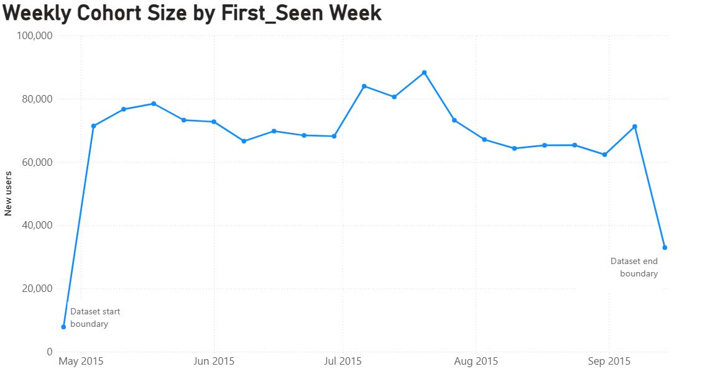
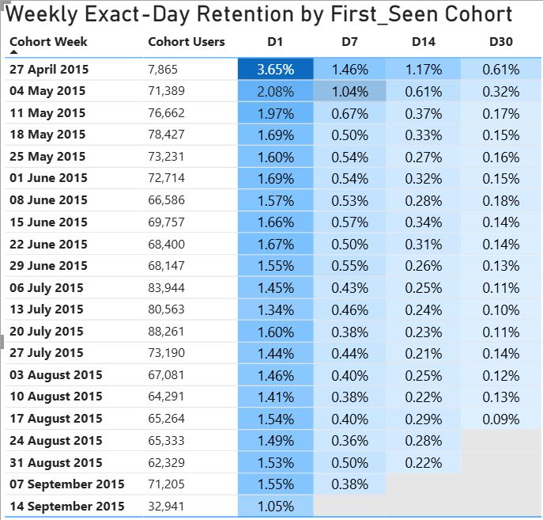
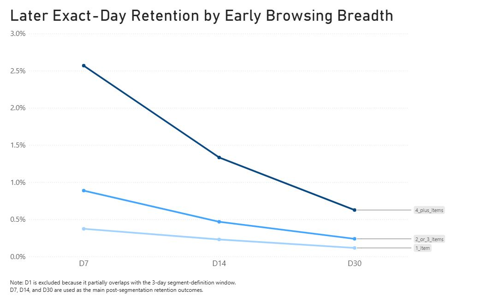

# PROJECT OVERVIEW
This project analyzes early user retention in an e-commerce event dataset. The business question is:

>Why are many newly observed users not returning after their first few sessions, and what can be done to improve retention?

The analysis focuses on three questions:
1. What does overall exact-day retention look like?
2. Is the retention pattern consistent across weekly cohorts?
3. Do users with different levels of early item exploration show different later retention outcomes?

The final goal is to identify an actionable early retention signal and translate it into e-commerce product recommendations.

# DATASET AND APPROACH
## Dataset
This project uses the Retailrocket e-commerce behavior dataset, analyzed in BigQuery with GoogleSQL. The dataset contains three main tables:
- `events` table: user-level interaction events, including view, addtocart, and transaction
- `item_properties` table: time-stamped item attribute records stored in an entity–attribute–value format
- `category_tree` table: the category hierarchy for items

The core analytical source is the `events` table because all three reporting views — overall retention, weekly cohort retention, and segmented retention by early browsing breadth — can be fully constructed from user-level event behavior.

## Data Preparation And Cleaning
Since core analytical source is the `events` table, I focused the main data preparation and cleaning process on making this table reliable for retention analysis.

Bcause the timestamp column was stored as epoch milliseconds, I converted it into UTC TIMESTAMP format and then performed key table-level quality checks to:
- checked for missing or NULL values in required fields
- identified and removed duplicate event logs by event identity, not necessarily exact duplicate rows, because transactionid is not included in the deduplication key.
- verified that event names were limited to the expected values
- checked that all transaction events had a valid transactionid & non-transaction events did not incorrectly contain a transactionid
- validated that event timestamps fell within a realistic observation window.

This process found 460 duplicate event logs under the event-identity rule, which were removed. After cleaning, I materialized the final dataset as `events_cleaned` table to support the downstream retention analysis more efficiently.

## Analytical Approach
This project uses a cohort-based retention analysis to examine why newly observed users do not return after their first few sessions.

Because the dataset does not include a true signup timestamp, I use each user’s first observed event date as a proxy cohort anchor. Retention is then measured as exact-day any-event return at D1, D7, D14, and D30.

The analysis is structured through three views:
1. **Overall exact-day retention**  
To establish the baseline return pattern.
2. **Weekly cohort heatmap**  
To check whether the retention pattern is broadly consistent across cohort weeks rather than driven by a few unusual periods.
3. **Segmented retention by early browsing breadth**  
To test whether users with different levels of early item exploration show different later retention outcomes.

This approach links the business question to both:
- when retention drop-off is most visible, and
- which early user behavior may help identify users who need retention intervention.

# DATA VALIDATION
Before building the final retention tables, I checked whether the dataset was suitable for cohort-based retention analysis. The validation focused on retention-critical risks: event continuity, anchor usability, observation-window sufficiency, cohort stability, and whether meaningful post-anchor return behavior exists.

## 1. Event timeline and volume stability
I first checked whether the event timeline showed signs of logging gaps or abnormal collapse in activity.

- No missing calendar days were found between the earliest and latest event dates.
- Monthly event volume remained broadly consistent across the dataset. The lower September volume is expected because the dataset ends on 2015-09-18, making September a partial month.

These checks suggest that the event stream is continuous enough for retention analysis.

## 2. Cohort anchor viability check
Because the dataset does not include a true registration timestamp or a true lifetime first-seen date, I defined anchor event as:

>first_seen = user’s first observed event date

This means the analysis measures first-observed retention, not true signup retention.

To check whether this proxy anchor was usable, I inspected the distribution of first_seen dates. The chart includes a 7-day moving average to smooth daily fluctuations and make the broader trend easier to inspect.

- No huge spike on the first dataset day, which suggests severe left-edge truncation is less likely.
- No long periods with zero or extremely low new users appear, which suggests logging is continuous.

Therefore, there is no obvious evidence of severe truncation or logging gaps, and first_seen is usable as a cohort anchor under the project assumptions.

## 3. Retention window sufficiency
This step verify that the dataset timeline is long enough to compute common retention windows.

Using the maximum event date (2015-09-18), the latest eligible cohort dates (retention cutoffs) were computed:
- D7 retention: cohorts on or before 2015-09-11
- D14 retention: cohorts on or before 2015-09-04
- D30 retention: cohorts on or before 2015-08-19

The results confirm that nearly all users are observable for D7 and D14, and most users are observable for D30. Therefore, the dataset provides sufficient time coverage for the selected retention windows.

## 4. Weekly cohort stability and boundary effects
I checked weekly cohort sizes because retention rates can become unstable when cohorts are too small.

Cohorts are defined using first_seen (anchor event) then count new users per ISO week

- Weekly cohorts are consistently large across the dataset (roughly ~60k–90k new users/week), indicating that retention estimates are based on sufficient sample sizes and are likely to be stable.
- The first and last cohort weeks show visible difference in size compared to the rest, suggesting potential boundary effects caused by incomplete data coverage at the start and end of the dataset. Therefore, the first and last cohort weeks are treated as boundary cohorts and excluded from reported retention metrics and interpretation.

## 5. Post-anchor return signal
Before building the final cohort retention tables, I checked whether the dataset contains meaningful post-anchor return behavior. This is a diagnostic check only; it is used to confirm that retention analysis will not collapse into all-zero outcomes.

In this diagnostic step, “returning/active” is defined broadly as having at least one post-anchor event of any type (`view`, `addtocart`, or `transaction`). Using cumulative return windows after Day 0, I checked whether they had at least one event within the following windows after first_seen

| cumulative post-anchor window| cumulative retention rate |
|-------------------|--------------------|
| D1                | ~1.6%              |
| D1-D7             | ~4.4%              |
| D1-D14            | ~5.6%              | 

The cumulative retention rates increase across wider windows, which is expected because users have more opportunities to return. This confirms that post-anchor return activity exists and that it is reasonable to proceed with the final exact-day retention analysis

## Overall Assessment
The data validation checks show that:
- event timeline continuity is stable
- event volume is sufficiently consistent for cohort analysis
- first_seen is usable as a proxy cohort anchor
- the dataset has enough observation time for D7, D14, and D30 retention
- weekly cohorts are large enough for stable comparison
- boundary cohorts can be identified and controlled
- meaningful post-anchor return behavior exists

Therefore, the dataset is suitable for cohort retention and segmented analysis under the defined assumptions.

# ANALYSIS
Following the validation steps above, the analysis proceeds in 3 reporting views:
1. **Overall exact-day retention** to establish the baseline return pattern
2. **Weekly cohort heatmap** to check whether the retention pattern is consistent across cohort weeks
3. **Segmented exact-day retention by early browsing breadth** to test whether users with different levels of early item exploration show different retention outcomes

The final analysis uses **exact-day any-event retention**. A user is counted as retained at D1, D7, D14, or D30 only if they have at least one event of any type (`view`, `addtocart`, or `transaction`) on that exact checkpoint day based on `TIMESTAMP_DIFF(..., DAY)`.

Following the boundary cohort check in Section 4.4, the first and last cohort weeks are excluded from all reported retention metrics to avoid bias from incomplete data coverage.

## 1. Overall exact-day retention baseline
| checkpoint | mature users | retained users | exact-day retention_rate |
|------------|--------------|----------------|----------------|
| D1         | 1,366,774    | 21,813         | 1.596%         |
| D7         | 1,328,821    | 6,756          | 0.508%         |
| D14        | 1,262,817    | 3,730          | 0.295%         |
| D30        | 1,115,048    | 1,651          | 0.148%         |

*Note: Mature users means users whose first_seen date is early enough that the dataset has enough observation time to measure that checkpoint.*

The output shows that exact-day retention remains under 2% at all reported checkpoints. This means that only a small share of mature users were active on those exact checkpoint days. Retention also declines at later checkpoints, which is consistent with the stricter exact-day definition.

## 2. Weekly cohort retention pattern consistency
To check whether the overall retention pattern was consistent across cohort weeks, I created a weekly cohort heatmap using exact-day retention at D1, D7, D14, and D30.

The output shows:
- Except for the first and last cohort week, the same declining exact-day retention pattern is visible across most weekly cohorts: D1 is the highest checkpoint, followed by a sharp drop by D7 and further declines at D14 and D30. This suggests that the overall retention shape is broadly consistent across cohorts rather than being driven by only a few specific weeks.

- The largest visible checkpoint-to-checkpoint decline occurs from D1 to D7, suggesting that the steepest loss of returning users happens early in the post-acquisition period.

- Later cohorts are blank at longer 
checkpoints, which is expected because they are not yet mature enough for those windows.

## 3. Retention differences by early browsing breadth
The primary segmentation is based on **distinct items interacted with in the first 3 days after `first_seen`**. Users are grouped into three buckets: `1_item`, `2_3_items`, and `4plus_items`. 

I selected this segmentation because it provided a clearer user-level behavioral signal and aligned with the business question. Alternative segmentation candidates were screened separately and are documented in the Appendix.

| segment       | D1 retention | D7 retention | D14 retention | D30 retention |
|---------------|--------------|--------------|---------------|---------------|
| 1_item        | 0.62%        | 0.37%        | 0.23%         | 0.12%         |
| 2_or_3_items  | 5.42%        | 0.89%        | 0.47%         | 0.24%         |
| 4_plus_items  | 11.83%       | 2.57%        | 1.33%         | 0.63%         |

*Note: Because D1 is partly inside the segment-definition window, I didn't use D1 retention as a key segmented outcome*

Because browsing breadth is defined using the first 3 days after first_seen, the segmented retention comparison focuses on later checkpoints after that early behavior window closes: D7, D14, and D30.

The output shows:
- Across all browsing-breadth segments, exact-day retention declines over time. 
- Retention is consistently ordered by early browsing breadth: The 4_plus_items segment has the highest retention at every checkpoint, followed by 2_or_3_items, while 1_item has the lowest retention. This suggests that users who explore more distinct items in the first 3 days after first_seen are associated with stronger later return behavior.

# KEY FINDINGS
The overall table shows that exact-day retention declines sharply after D1. The weekly cohort heatmap confirms that this pattern is broadly consistent across mature cohort weeks rather than being driven by one unusual cohort. Together, these two views show that early retention drop-off is a recurring pattern in the dataset, not an isolated fluctuation.

Within that recurring pattern, the largest visible checkpoint-to-checkpoint decline occurs from D1 to D7, making D1–D7 the most obvious first intervention window. The segmented retention analysis then adds a more actionable layer: early browsing breadth is meaningfully associated with later D7, D14, and D30 return behavior, giving a clearer signal for which early users may need intervention.

# RECOMMENDED ACTIONS
- **Improving early item exploration:** during the first 3 days, showing related items, recently viewed recommendations or homepage recommendations to encourage newly observed users to explore more than one item

- **Encouraging low-breadth users to return soon after their first observed activity:** shortly after the first 3 days, targeting on users who interact with only 1 item during their first 3 days, sending reminders such as email, push notification showing similar items to bring customers back before D7.

- **D14 and D30 should remain follow-up checkpoints** to confirm whether these early improvements last, not just short-term return behavior.

# LIMITATION
- **Cohort anchor is a proxy**  
The dataset does not include true signup timestamps, so Day 0 is approximated using each user’s first observed event date. The analysis therefore reflects first-observed retention rather than true signup-based retention.

- **Day 0 is not behaviorally identical across all users**  
A user’s first observed event can be a view, addtocart, or transaction, so users are not guaranteed to enter the analysis at the same behavioral stage, reducing comparability across cohorts.

- **Results are limited to the available observation window**  
The analysis captures retention only within the dataset’s time range and does not represent users’ full lifecycle history.

- **Day buckets use rolling 24-hour intervals, not calendar days**  
Retention windows are defined using rolling 24-hour interval from `first_seen` by TIMESTAMP_DIFF(...,DAY), not calendar-day boundaries. As a result, a user who returns shortly after midnight (but within 24 hours) is still counted as Day-0 rather than D1. These retention rates are therefore not directly comparable to standard calendar-day retention benchmarks.

- **The browsing-breadth segmentation rule is project-specific**  
The selected early browsing breadth segmentation is useful for this project, but the bucket design is a custom analytical choice rather than a universal business rule.

# FUTURE WORK
- **Improve the cohort anchor:** In future work, I would apply a washout period before anchoring retention or use a true acquisition timestamp if available.

- **Add buyer-focused retention analysis:** Buyer segmentation retention is saved for future work, which would answer a narrower follow-up question: whether purchasing users retain differently from non-purchasing users.

# APPENDIX
- During initial project scoping, I also reviewed `item_properties` and `category_tree` tables as possible inputs for item-context or category-based retention segmentation. They were cleaned and validated during exploration, but they were not carried into the final reporting views because the selected retention analysis and segmentation could be fully supported by event-level behavior from the events table alone.
### Item_properties table
The item_properties table is an entity–attribute–value change log. Because `timestamp` was stored as epoch milliseconds, I converted it into UTC TIMESTAMP format. I then selected the interpretable properties categoryid and available, together with one exploratory numeric property, 790, which was parsed into p1_numeric.

I then checked for:
- missing or NULL or blank values
- duplicate or conflicting records
- parser correctness for the selected typed fields
- unexpected property keys
- unusual values in categoryid, available, and p1_numeric.
- timestamp ranges that might indicate invalid or future-dated records.

The selected item properties were successfully parsed and retained in `item_properties_cleaned`. Extreme values in p1_numeric were flagged for caution rather than removed, because the business meaning of that anonymized property is unknown.

### Category_tree table
I validated the category_tree table to ensure the category hierarchy was structurally usable. The checks covered:
- expected NULL parentid values for root categories
- duplicate or conflicting category assignments
- orphan category nodes.

No structural issues were found, so the original category tree table was kept as-is.